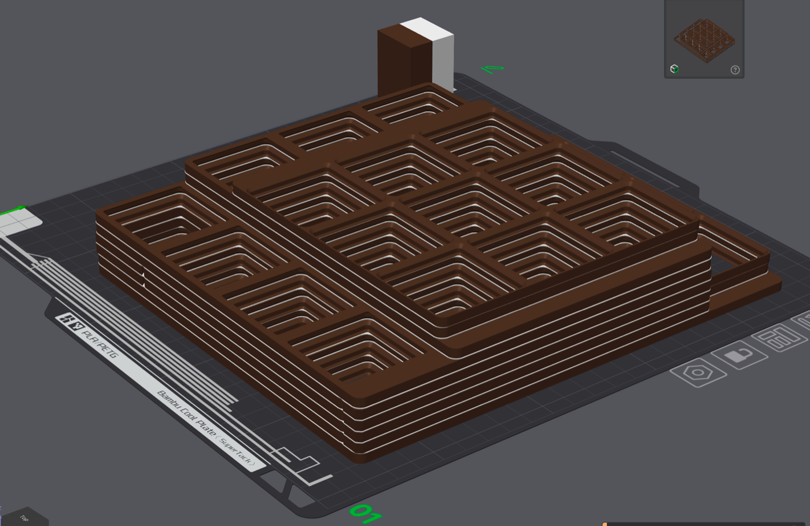

# gridfinity-base-stacker

Takes a multi-plate Gridfinity baseplate STL and stacks the plates into one
model that prints in a single job. The plates are separated by gaps filled with a
solid printed in a second, non-bonding filament -- Bambu Support W against PLA --
which is peeled off afterwards so the stack comes apart into separate plates.

**Status: the separation is not working yet.** The geometry and the slicing are
verified, but no test print has yet come apart cleanly -- one film material
peeled off mid-print, the other stuck too hard to remove.
[ADR 0008](docs/adr/0008-what-the-first-test-prints-showed.md) has the results.

The slicer generates **no support at all**. Every overhang is carried by geometry
the tool puts there.



Nine plates of a drawer set as one job: the brown is the stack and its pillars,
the white is the film filling each gap. The small block at the back is the wipe
tower.

Stdlib Python only: no numpy, no trimesh, no mesh kernel. Meshes are flat tuples
of floats and every geometric question is answered by ray casting or by
rasterising to a grid.

## Getting a source model

The plates themselves come from **Gridfinity Extended**, which generates a
multi-plate baseplate STL:

<https://gridfinity.perplexinglabs.com/pr/gridfinity-extended/0/1>

Generate the set you want as a single STL with all plates in it -- this tool
splits them apart itself. It expects extended baseplates: a 42 mm cell lattice
with tapered sockets, no magnet holes required.

## Use

```
python3 stack_plates.py path/to/multiplate.stl
python3 make3mf.py --template templates/stack-template.3mf \
    --model out/NAME.stl --plates out/NAME.plates.json \
    --interface out/NAME-interface.stl --out out/NAME.3mf
```

Open the 3mf in Bambu Studio and print it. Nothing else to configure: the
template carries the plate layout, the filament assignments, the film's print
settings, and support switched off.

| file | what it is |
|---|---|
| `NAME.stl` | the stack: plates plus the pillars that carry them |
| `NAME-interface.stl` | the film that fills each gap, printed in the second filament |
| `NAME.plates.json` | where every plate ended up; the 3mf builder reads it |
| `NAME-PRINTING.md` | settings and notes for this particular stack |
| `NAME.3mf` | the project, ready to slice |

## How it works

1. Split the STL into shells by welding vertices.
2. Find each plate's 42 mm cell lattice by flood-filling the bottom face.
3. Order the plates so each sits on the one below wherever the containment order
   allows ([ADR 0001](docs/adr/0001-alternating-flip-and-lattice-registration.md)).
4. Rotate every other plate 180 degrees and register the lattices onto a common
   origin, so every interface is land-to-land or rib-to-rib.
5. Raise a **pillar** wherever a plate has material with nothing beneath it
   ([ADR 0005](docs/adr/0005-support-what-has-nothing-under-it.md)).
6. Fill each gap with a **film** that carries the plates and the pillars, bridged
   so it lifts as one sheet
   ([ADR 0007](docs/adr/0007-bridge-the-film-so-it-lifts-as-one-sheet.md)).

### Pillars

Not just plates hanging past the edge of the one below. The case that bites is a
narrower plate whose solid border lands over a wider plate's socket opening --
those sockets are through-holes, so that border can need carrying to the bed.
Comparing footprints misses it entirely; the tool rasterises each plate's
downward face against what lies beneath and takes the difference.

Pillars are grown outward for stability and held clear of the plates only where
they would meet one. Each connected region is traced into a single solid, so
outlines follow the socket instead of stepping around it
([ADR 0006](docs/adr/0006-one-solid-where-we-can-overlap-where-we-cannot.md)).

### The film

Two layers, each stepping 0.2 mm further out than the one below, so it leans at
45 degrees and bridges unaided. It is held **0.1 mm clear of the plates**, and
that clearance is not optional: it has to leave one layer with no model material
on it, or the slicer treats film and plate as one body and they print welded.
ADR 0007 has the mechanism, from the slicer's own source.

The film is trimmed to what it actually carries, then bridged across short spans
so each gap is one sheet rather than islands stranded on pillar tops.

## Options

`--gap` 0.6 mm, `--interface-clearance` 0.1 mm, `--bridge-span` 6 mm and
`--filler-grow` 0.4 mm are the ones with measurements behind them; each option's
help text carries the numbers and what was swept to arrive at them.

```
python3 stack_plates.py --help
```

`--split` emits one stack per chain of the containment order, so nothing
overhangs anything -- fewer pillars, at the cost of one print job per stack.

Earlier versions carried machinery for three approaches that no longer exist
here: support blockers and enforcers, a decoy column to provoke filament changes,
and a G-code pass to delete support the slicer insisted on generating. All of it
is gone, because the slicer now generates no support at all. What was learned
from each is in [ADR 0003](docs/adr/0003-support-generation-findings.md) and
[ADR 0004](docs/adr/0004-strip-balconies-in-gcode.md), which is the part worth
keeping; git history has the code.

## The template

`templates/stack-template.3mf` carries the plate layout, wipe tower position,
filament assignments, all the project settings, and the per-part print settings
for the stack and the film. Placeholder blocks stand in for the geometry, so no
one's model lives in this repository.

To change any of it, arrange it in Bambu Studio, save with **File > Save Project
As**, and point `--template` at the result. Note that per-part settings live in
`Metadata/model_settings.config`, not in the project settings -- a diff of the
project settings shows nothing at all when someone has configured a part.

## Verifying

```
python3 -m unittest test_stack_plates test_postprocess
```

`verify.py` checks a written stack independently of the plan that produced it:
manifold edges, film regions per gap, and clearances.

Verify against a sliced file, not only the test suite. The suite has passed while
the model printed into air. Note also that a CLI slice is evidence only where the
geometry is unambiguous -- ADR 0007 records a case where the CLI and the GUI gave
opposite answers on the same file.

## Licence

MIT -- see [LICENSE](LICENSE).

The baseplate geometry itself is not this project's work: plates come from
[Gridfinity Extended](https://gridfinity.perplexinglabs.com/pr/gridfinity-extended/0/1),
and Gridfinity is Zack Freedman's design.

## Working on this

Changes go through OpenSpec (`openspec/`): `/opsx:propose` to write one,
`/opsx:apply` to implement it, `/opsx:archive` when it lands. The project context
in `openspec/config.yaml` carries the domain facts that are not guessable from
the code.

Decisions live in `docs/adr`. Several exist specifically to stop approaches being
re-tried after they measured as dead ends.
